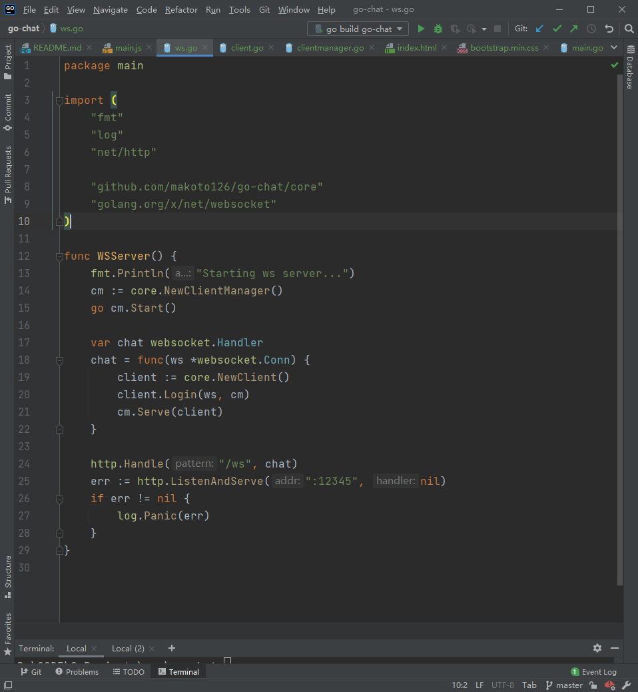
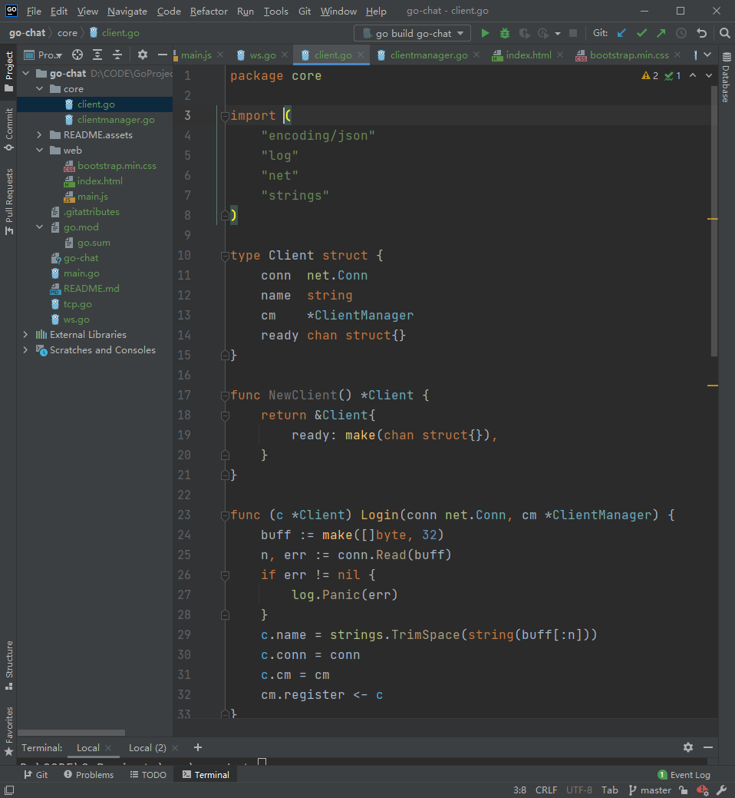
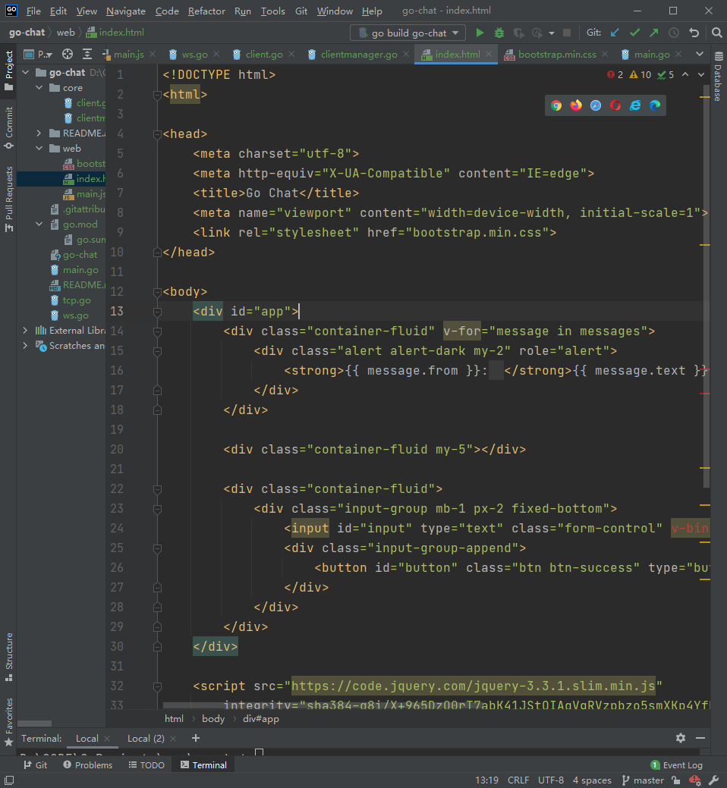
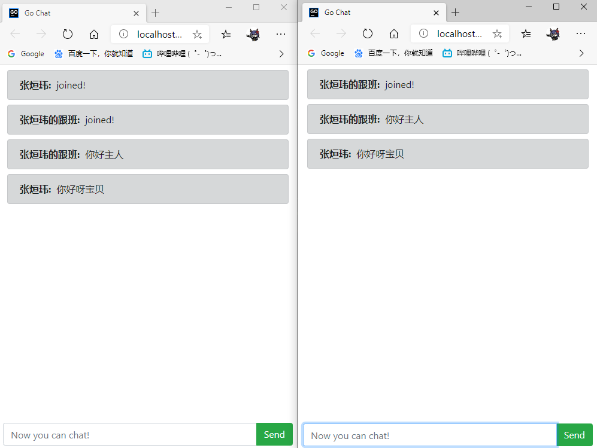

# go-chat
启动tcp客户端（命令行）：go run go-chat  
启动tcp服务端：go run go-chat tcp  
启动ws服务端：go run go-chat ws  
启动web客户端 index.html
web文件夹里是ws的用户界面

## 服务器端



### 核心代码

```go
package main

import (
	"fmt"
	"log"
	"net/http"

	"github.com/makoto126/go-chat/core"
	"golang.org/x/net/websocket"
)

func WSServer() {
	fmt.Println("Starting ws server...")
	cm := core.NewClientManager()
	go cm.Start()

	var chat websocket.Handler
	chat = func(ws *websocket.Conn) {
		client := core.NewClient()
		client.Login(ws, cm)
		cm.Serve(client)
	}

	http.Handle("/ws", chat)
	err := http.ListenAndServe(":12345", nil)
	if err != nil {
		log.Panic(err)
	}
}
```


## 客户端



### 核心代码

```go
package core

import (
	"encoding/json"
	"log"
	"net"
	"strings"
)

type Client struct {
	conn  net.Conn
	name  string
	cm    *ClientManager
	ready chan struct{}
}

func NewClient() *Client {
	return &Client{
		ready: make(chan struct{}),
	}
}

func (c *Client) Login(conn net.Conn, cm *ClientManager) {
	buff := make([]byte, 32)
	n, err := conn.Read(buff)
	if err != nil {
		log.Panic(err)
	}
	c.name = strings.TrimSpace(string(buff[:n]))
	c.conn = conn
	c.cm = cm
	cm.register <- c
}

func (c *Client) Logout() {
	c.cm.unregister <- c
	c.conn.Close()
}

func (c *Client) NewMessage(s string) *Message {
	return &Message{
		From: c.name,
		Text: s,
	}
}

func (c *Client) loginMessage() *Message {
	return c.NewMessage("joined!\n")
}

func (c *Client) logoutMessage() *Message {
	return c.NewMessage("leaved!\n")
}

type Message struct {
	From string `json:"from,omitempty"`
	Text string `json:"text,omitempty"`
}

func (m *Message) ToString() []byte {
	return []byte(m.From + ": " + m.Text)
}

func (m *Message) ToJson() []byte {
	b, err := json.Marshal(m)
	if err != nil {
		log.Println(err)
	}
	return b
}

```
## ws用户界面


### 核心代码

```html
<!DOCTYPE html>
<html>

<head>
    <meta charset="utf-8">
    <meta http-equiv="X-UA-Compatible" content="IE=edge">
    <title>Go Chat</title>
    <meta name="viewport" content="width=device-width, initial-scale=1">
    <link rel="stylesheet" href="bootstrap.min.css">
</head>

<body>
    <div id="app">
        <div class="container-fluid" v-for="message in messages">
            <div class="alert alert-dark my-2" role="alert">
                <strong>{{ message.from }}:&nbsp;&nbsp;</strong>{{ message.text }}
            </div>
        </div>

        <div class="container-fluid my-5"></div>

        <div class="container-fluid">
            <div class="input-group mb-1 px-2 fixed-bottom">
                <input id="input" type="text" class="form-control" v-bind:placeholder="placeholder" v-model="text">
                <div class="input-group-append">
                    <button id="button" class="btn btn-success" type="button" v-on:click="send">Send</button>
                </div>
            </div>
        </div>
    </div>

    <script src="https://code.jquery.com/jquery-3.3.1.slim.min.js"
        integrity="sha384-q8i/X+965DzO0rT7abK41JStQIAqVgRVzpbzo5smXKp4YfRvH+8abtTE1Pi6jizo"
        crossorigin="anonymous"></script>
    <script src="https://cdnjs.cloudflare.com/ajax/libs/popper.js/1.14.7/umd/popper.min.js"
        integrity="sha384-UO2eT0CpHqdSJQ6hJty5KVphtPhzWj9WO1clHTMGa3JDZwrnQq4sF86dIHNDz0W1"
        crossorigin="anonymous"></script>
    <script src="https://stackpath.bootstrapcdn.com/bootstrap/4.3.1/js/bootstrap.min.js"
        integrity="sha384-JjSmVgyd0p3pXB1rRibZUAYoIIy6OrQ6VrjIEaFf/nJGzIxFDsf4x0xIM+B07jRM"
        crossorigin="anonymous"></script>
    <script src="https://cdn.jsdelivr.net/npm/vue/dist/vue.js"></script>
    <script src="main.js"></script>
</body>

</html>
```


## 演示界面



使用Go语言开发

实现了多用户同时在WEB端在线聊天